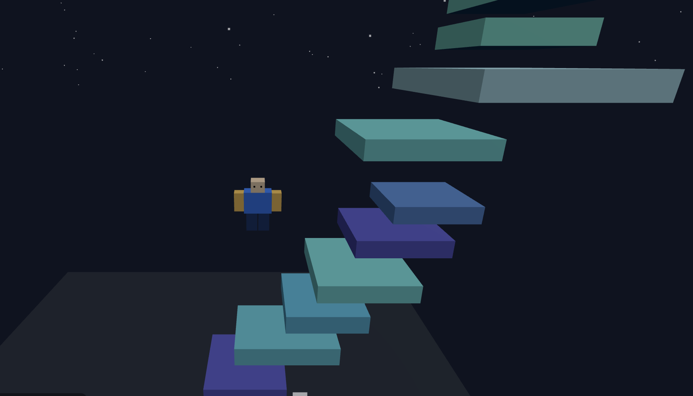

# 🕹️ Highest Wins!

A 3D platform-jumping game built with Three.js and crafted entirely through a series of creative prompts to ChatGPT.

## 🎮 Overview

This project was co-created with ChatGPT, which generated the core code, physics, and design based on a sequence of developer prompts. 

It was then `integrated with the VIVERSE Worlds` using the [VIVERSE SDK](https://docs.viverse.com/developer-tools) to include login, avatar, and leaderboard features. Utimately, the game was published on the VIVERSE Worlds platform.

Play Highest Wins! online now: https://worlds.viverse.com/2ndfQgt

## 📸 Screenshots

Screenshot of the gameplay:

Watch the gameplay demo: https://youtu.be/fZc4cgZk9-g

## 🚀 Quick Start

Highest Wins! is a simple yet addictive 3D mini-game where players control a Roblox-style character to jump between floating platforms and reach the greatest height possible. The higher you climb, the higher your score — and your name could top the leaderboard!

Simply visit [Highest Wins!](https://worlds.viverse.com/2ndfQgt) on VIVERSE Worlds.

Or

Clone or download the git project.

Open index.html in your browser — no build steps required.

Use W, A, S, D to move and Space to jump.

Try to climb as high as you can — and don’t fall!

## ✨ Features

3D Gameplay: Built with Three.js via CDN, fully runnable in any modern browser.

Character Controls:

Move with W, A, S, D

Jump with Space

Solid Platforms: Realistic grounding and collision detection for jumping mechanics.

Scoring: Tracks the player’s maximum height in real time.

Leaderboards: Includes hooks for uploading scores via [VIVERSE SDK](https://docs.viverse.com/developer-tools).

## 🧠 Development Story

This game emerged from an iterative conversation between me and ChatGPT. Each stage — from physics tuning to camera control and character behavior — was guided by my own prompts and ChatGPT’s generated responses.
You can explore the original prompts I used (included in [PROMPTS.md](PROMPTS.md)) to see how the project evolved prompt-by-prompt.

## 🧩 Tech Stack

Language: JavaScript (ES6)

Framework: Three.js

Environment: HTML5 / WebGL

Optional Integrations:

- [VIVERSE Login & Authentication SDK](https://docs.viverse.com/developer-tools/login-and-authentication-for-the-sdk)
- [VIVERSE Avatar SDK](https://docs.viverse.com/developer-tools/avatar-sdk)
- [VIVERSE Leaderboard SDK](https://docs.viverse.com/developer-tools/leaderboard-sdk)

## 👨‍💻 Author

Steven (Phineas) Chou — Software Engineer & Creator of Highest Wins!
Built in collaboration with ChatGPT (OpenAI).